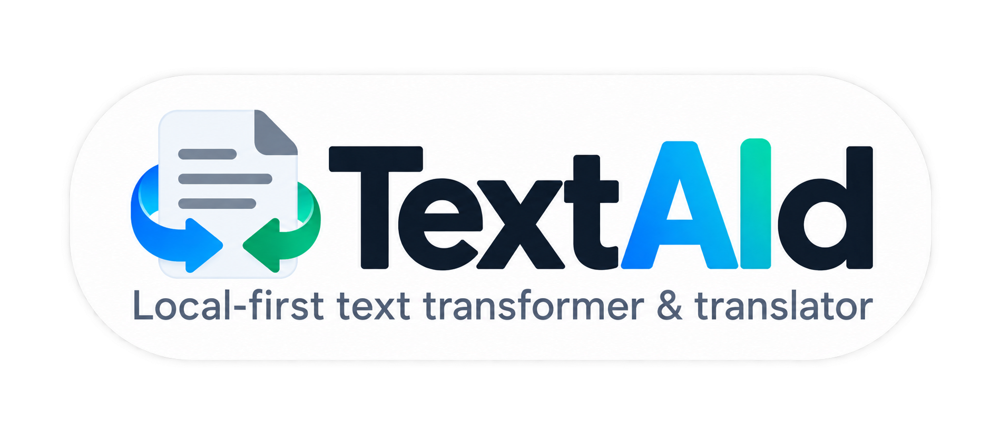

# TextAid

<p align="center">
  
</p>

**Local-first text transformer & translator for Windows.**

TextAid captures selected text from another Windows application, applies one configurable AI transformation, shows the result, and lets the user replace the original selection, copy the result, or cancel. It uses a local Ollama model by default; a remote provider is an explicit user choice.

## App preview


## Features

- Capture selected text with `Ctrl+C`, then `C` to choose an action, or `Ctrl+C`, then `T` for immediate translation.
- Rewrite, correct, translate, summarize, shorten, expand, simplify, change tone, humanize, or create declarative custom actions.
- Preview raw or rendered Markdown results in a dark Windows interface.
- Keep model traffic local by default, with clear configuration for on-premises or external providers.
- Run as a self-contained Windows x64 executable; no .NET runtime is required for the published application.

## Requirements

- Windows x64
- .NET SDK 10 for building from source
- [Ollama](https://ollama.com/) and a compatible local model for the default configuration

## Build and test

In PowerShell, from the repository root:

```powershell
$env:NUGET_SCRATCH = Join-Path (Get-Location) 'src\TextAid.App\obj\NuGetScratch'
New-Item -ItemType Directory -Path $env:NUGET_SCRATCH -Force | Out-Null
dotnet restore TextAid.sln -m:1 -p:NuGetAudit=false
dotnet build TextAid.sln -m:1 -p:NuGetAudit=false
dotnet test TextAid.sln -m:1 -p:NuGetAudit=false
```

To create the canonical single-file Release executable, run:

```powershell
.\publish.ps1
```

The resulting executable is `src/TextAid.App/bin/Publish/TextAid.exe`.

## Project method

This repository is maintained with **SAW 3.2 (SDD Another Way)**, a method created by Olivier Dahan © 2025–2026 that carries forward Pro-Spec 3. The method is Markdown- and Git-native: it does not depend on an external tool.

The product intent, enduring rules, decisions, project status, and historical specifications remain in the repository. Before changing a planned lot or its validation state, follow the entry procedure in [the SAW 3.2 / Pro-Spec 3 reference](docs/PROSPEC-3-SPECIFICATION.md). French source copies are retained beside the translated documents with the `.FR.md` suffix.

## AI-centric bootstrap

To conduct this project with an AI, use this prompt:

> **Read the `README.md` file and execute the next step.**

The active bootstrap is deliberately contained in this README. An AI must first read the product intent in `PROJECT.md`, enduring constraints in `RULES.md`, all active decisions in `LEDGER.md` (and any referenced obsolete decisions), and the current plan in `STATUS.md`. It must then read the active lot's `SPEC`, `FINDINGS`, `GATES`, and, where present, `CONVERGENCE`. Consult `HISTORY.md` when chronology helps recovery or audit.

`STATUS.md` is the sole authority for lot state. It identifies the next `Planned` lot and its dependencies; only one lot may be `In-progress`, `Ready-to-close`, or `Blocked` at a time. A human decision is required to move a lot to `In-progress`, to close it, to validate a HUMAN gate, to accept a deviation, or to make another significant change of meaning.

While a lot is active, implement its `SPEC`, record knowledge in `FINDINGS`, keep the result location, remaining work, blockers, and next action recoverable through `STATUS.md`, and append significant operations to `HISTORY.md`. Evaluate every gate against an identifiable result. A lot may close only when every applicable gate is validly `PASS` or `N/A`, all requirements and findings have been accounted for, and a human accepts the closure. Update `STATUS.md` last.

> If you need an AI powerful enough to manage your project, and the project is large enough to require a method, then the AI being used is sufficient to manage all of the method's bureaucracy.

The complete historical bootstrap is preserved unchanged in [docs/README.BOOTSTRAP.md](docs/README.BOOTSTRAP.md). The active instructions above supersede only its former references to an external Pro-Spec tool, which SAW 3.2 no longer uses.

## Method validation

TextAid was built both for its own purpose and to put SAW to the test. Its development used only GPT-5.6 Terra with Medium reasoning effort and an OpenAI USD 20 subscription. The project demonstrates that Microsoft’s Spec-Driven Development (SDD) can be adapted into a practical, fully AI-centric method. SAW (SDD Another Way) is that adaptation: an alternative to the support provided by Microsoft’s Spec-Kit for applying SDD in a real project.

## Documentation

- [Product intent](PROJECT.md)
- [Current project status](STATUS.md)
- [Language-pack layout](docs/language-packs.md)
- [Source specification map](docs/SOURCE-MAP.md)
- [SAW 3.2 / Pro-Spec 3 reference](docs/PROSPEC-3-SPECIFICATION.md)
- [Original bootstrap README](docs/README.BOOTSTRAP.md)

## License and attribution

TextAid is source-available under the [Creative Commons Attribution-NonCommercial 4.0 International License](LICENSE). You may copy, share, and adapt it for non-commercial purposes only. Every distribution must retain the attribution **Olivier Dahan © 2026** and the contact `odahan [at] e-naxos [dot] com`, indicate changes, and include the license notice. Commercial use requires the author's prior written agreement.

This is intentionally a non-commercial license and therefore is not an OSI-approved Open Source license.
